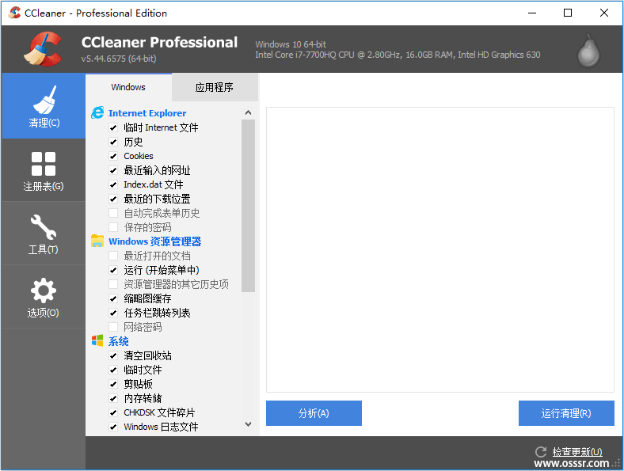

# CCleaner 6.41.11566 便携版 - 系统清理工具

CCleaner 是一款非常流行的电脑清理和优化工具，由 Piriform 公司开发。它能够帮助你删除无用的文件、清理系统垃圾、卸载不需要的程序、修复注册表错误等，从而提高系统性能并释放磁盘空间。还可以进行隐私保护，例如清除浏览器历史记录、缓存文件、cookie 等，保护你的个人隐私。

官方网站：www.piriform.com

## 截屏

## **功能摘要**

1. 垃圾文件清理
   - 清理临时文件、缓存和系统垃圾，释放磁盘空间，提升设备运行速度。
2. 隐私保护
   - 安全删除浏览历史记录、Cookies、下载记录等，保护用户隐私。
3. 注册表修复
   - 查找并修复无效或损坏的注册表项，确保系统稳定运行。
4. 软件卸载管理
   - 简化程序卸载流程，帮助清理残留文件，彻底移除不需要的应用。
5. 启动项管理
   - 优化开机启动项，减少系统启动时间，加快计算机启动速度。
6. 自动更新
   - 支持自动更新功能，确保用户始终使用最新版本和功能。
7. 系统监控
   - 实时监控系统状态，帮助用户发现并解决潜在问题。
8. 浏览器插件管理
   - 管理和禁用不必要的浏览器插件，提升浏览器运行效率。
9. 硬盘分析
   - 检测磁盘使用情况，提供详细的存储报告，帮助优化存储空间。
10. 文件恢复
    - 附带文件恢复工具，帮助找回意外删除的文件。

## 更新日志

https://www.ccleaner.com/ccleaner/version-history

**Version 6.41.11566

**Version 6.38.11537

**Version 6.36.11508

**Version 6.34.11482

## 模组信息

- 禁止更新检查，禁用软件更新；
- 删除关于里一系列链接等；
- 删除右上角帮助，账号管理、及底部检查更新按钮；
- 禁止联网验证请求，提升启动速度；

## 下载地址

[CCleaner 6.41.11566 去广告便携版]()
